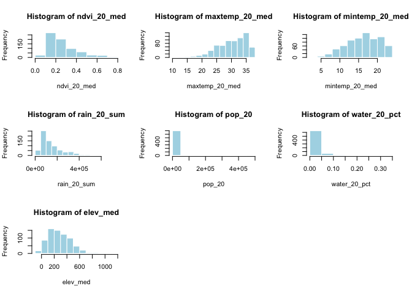
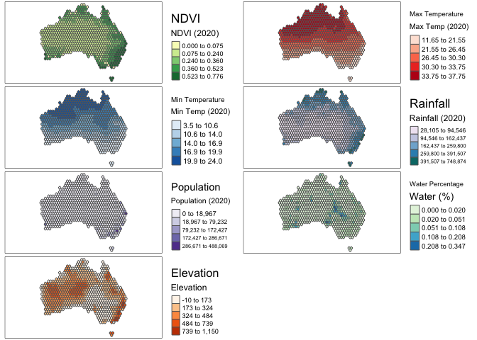
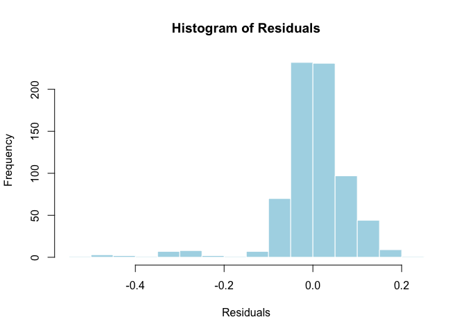
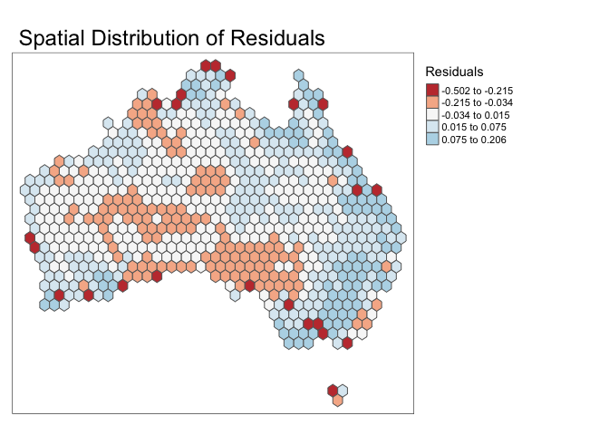
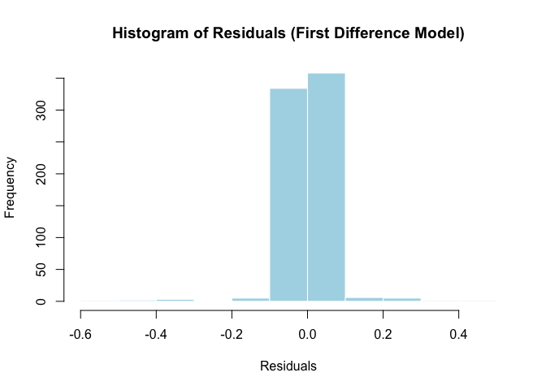
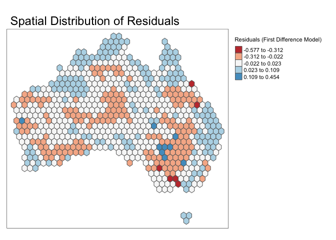

Geog6300: Lab 6
================

## Regression

``` r
library(sf)
library(tidyverse)
```

**Overview:** This lab focuses on regression techniques. You’ll be
analyzing the association of various physical and climatological
characteristics in Australia with observations of several animals
recorded on the citizen science app iNaturalist.

\###Data and research questions###

Let’s import the dataset.

``` r
lab6_data<-st_read("data/aus_climate_inat.gpkg")
```

    ## Reading layer `aus_climate_inat' from data source 
    ##   `/Users/jiayi/Downloads/lab6/data/aus_climate_inat.gpkg' using driver `GPKG'
    ## Simple feature collection with 716 features and 22 fields
    ## Geometry type: POLYGON
    ## Dimension:     XY
    ## Bounding box:  xmin: 113.875 ymin: -43.38632 xmax: 153.375 ymax: -11.92074
    ## Geodetic CRS:  WGS 84 (CRS84)

The dataset for this lab is a 1 decimal degree hexagon grid that has
aggregate statistics for a number of variables:

- ndvi: NDVI/vegetation index values from Landsat data (via Google Earth
  Engine). These values range from -1 to 1, with higher values
  indicating more vegetation.
- maxtemp_00/20_med: Median maximum temperature (C) in 2000 or 2020
  (data from SILO/Queensland government)
- mintemp_00/20_med: Median minimum temperature (C) in 2020 or 2020
  (data from SILO/Queensland government)
- rain_00/20_sum: Total rainfall (mm) in 2000 or 2020 (data from
  SILO/Queensland government)
- pop_00/20: Total population in 2000 or 2020 (data from NASA’s Gridded
  Population of the World)
- water_00/20_pct: Percentage of land covered by water at some point
  during the year in 2000 or 2020
- elev_med: Median elevation (meters) (data from the Shuttle Radar
  Topography Mission/NASA)

There are also observation counts from iNaturalist for several
distinctively Australian animal species: the central bearded dragon, the
common emu, the red kangaroo, the agile wallaby, the laughing
kookaburra, the wombat, the koala, and the platypus.

Our primary research question is how the climatological/physical
variables in our dataset are predictive of the NDVI value. We will build
models for 2020 as well as the change from 2000 to 2020. The second is
referred to as a “first difference” model and can sometimes be more
useful for identifying causal mechanisms.

\###Part 1: Analysis of 2020 data###

We will start by looking at data for 2020.

**Question 1** *Create histograms for NDVI, max temp., min temp., rain,
and population, and water in 2020 as well as elevation. Based on these
graphs, assess the normality of these variables.*

``` r
# Histograms for variables in 2020
variables <- c("ndvi_20_med", "maxtemp_20_med", "mintemp_20_med", "rain_20_sum", "pop_20", "water_20_pct", "elev_med")

par(mfrow = c(3, 3))  # Layout for multiple plots
for (var in variables) {
  hist(lab6_data[[var]], main = paste("Histogram of", var), xlab = var, col = "lightblue", border = "white")
}
```

<!-- -->

{Your assessment of the variables’ normality goes here.} NDVI
(`ndvi_20_med`) is heavily concentrated at lower values, which suggests
a strong right-skew. Maximum temperature (`maxtemp_20_med`) is strongly
left_skewed with highly concentrated higher values. On the other hand,
minimum temperature (`mintemp_20_med`) display distributions closer to
normal, appearing relatively symmetric around their peaks. Rainfall
(`rain_20_sum`) is highly right-skewed, with most areas experiencing low
rainfall, while a few regions have extremely high values. Population
(`pop_20`) shows extreme skewness, with the majority of hexagons having
very low population counts, and only a few having large populations.
Water percentage (`water_20_pct`) is also strongly right-skewed, with
most areas having little to no water coverage. Elevation (`elev_med`) is
slightly right-skewed, with most values concentrated in the lower to
mid-elevation range but less extreme than other variables like
population or rainfall.

**Question 2** *Use tmap to map these same variables using Jenks natural
breaks as the classification method. For an extra challenge, use
`tmap_arrange` to plot all maps in a single figure.*

``` r
library(tmap)
```

    ## Breaking News: tmap 3.x is retiring. Please test v4, e.g. with
    ## remotes::install_github('r-tmap/tmap')

``` r
# Set tmap mode to "plot" for static maps
tmap_mode("plot")
```

    ## tmap mode set to plotting

``` r
# Create individual maps using Jenks natural breaks
map_ndvi <- tm_shape(lab6_data) +
  tm_polygons("ndvi_20_med", style = "jenks", palette = "YlGn", title = "NDVI (2020)") +
  tm_layout(title = "NDVI", legend.outside = TRUE)

map_maxtemp <- tm_shape(lab6_data) +
  tm_polygons("maxtemp_20_med", style = "jenks", palette = "Reds", title = "Max Temp (2020)") +
  tm_layout(title = "Max Temperature", legend.outside = TRUE)

map_mintemp <- tm_shape(lab6_data) +
  tm_polygons("mintemp_20_med", style = "jenks", palette = "Blues", title = "Min Temp (2020)") +
  tm_layout(title = "Min Temperature", legend.outside = TRUE)

map_rain <- tm_shape(lab6_data) +
  tm_polygons("rain_20_sum", style = "jenks", palette = "PuBuGn", title = "Rainfall (2020)") +
  tm_layout(title = "Rainfall", legend.outside = TRUE)

map_population <- tm_shape(lab6_data) +
  tm_polygons("pop_20", style = "jenks", palette = "Purples", title = "Population (2020)") +
  tm_layout(title = "Population", legend.outside = TRUE)

map_water <- tm_shape(lab6_data) +
  tm_polygons("water_20_pct", style = "jenks", palette = "GnBu", title = "Water (%)") +
  tm_layout(title = "Water Percentage", legend.outside = TRUE)

map_elevation <- tm_shape(lab6_data) +
  tm_polygons("elev_med", style = "jenks", palette = "Oranges", title = "Elevation") +
  tm_layout(title = "Elevation", legend.outside = TRUE)

# Arrange all maps in a single figure
tmap_arrange(map_ndvi, map_maxtemp, map_mintemp, map_rain, map_population, map_water, map_elevation, ncol = 2)
```

    ## Legend labels were too wide. The labels have been resized to 0.6, 0.6, 0.6, 0.6, 0.6. Increase legend.width (argument of tm_layout) to make the legend wider and therefore the labels larger.

    ## Legend labels were too wide. The labels have been resized to 0.53, 0.49, 0.46, 0.46, 0.46. Increase legend.width (argument of tm_layout) to make the legend wider and therefore the labels larger.

    ## Some legend labels were too wide. These labels have been resized to 0.52, 0.49, 0.46, 0.46. Increase legend.width (argument of tm_layout) to make the legend wider and therefore the labels larger.

    ## Legend labels were too wide. The labels have been resized to 0.6, 0.6, 0.6, 0.6, 0.6. Increase legend.width (argument of tm_layout) to make the legend wider and therefore the labels larger.

<!-- -->

**Question 3** *Based on the maps from question 3, summarise major
patterns you see in the spatial distribution of these data from any of
your variables of interest. How do they appear to be associated with the
NDVI variable?*

{Your response here.} The spatial distribution of NDVI in 2020 reveals
higher values in the northeastern and southeastern regions of Australia,
which coincide with areas of higher rainfall, indicating a strong
positive association. In contrast, central and western regions with
higher maximum and minimum temperatures show significantly lower NDVI
values, suggesting a negative relationship with max and min temperature.
Population and elevation exhibit weaker associations, as NDVI is
primarily driven by climatic factors like rainfall and temperature
rather than human density or terrain.

**Question 4** *Create univariate models for each of the variables
listed in question 1, with NDVI in 2020 as the dependent variable. Print
a summary of each model. Write a summary of those results that indicates
the direction, magnitude, and significance for each model coefficient.*

``` r
# List of independent variables
independent_vars <- c("maxtemp_20_med", "mintemp_20_med", "rain_20_sum", "pop_20", "water_20_pct", "elev_med")

# Create univariate regression models and store them
univariate_models <- lapply(independent_vars, function(var) {
  formula <- as.formula(paste("ndvi_20_med ~", var))
  lm(formula, data = lab6_data)
})

# Print summaries of each model
model_summaries <- lapply(univariate_models, summary)

# Display summaries for interpretation
names(model_summaries) <- independent_vars
model_summaries
```

    ## $maxtemp_20_med
    ## 
    ## Call:
    ## lm(formula = formula, data = lab6_data)
    ## 
    ## Residuals:
    ##      Min       1Q   Median       3Q      Max 
    ## -0.41874 -0.07657 -0.01927  0.06833  0.36382 
    ## 
    ## Coefficients:
    ##                  Estimate Std. Error t value Pr(>|t|)    
    ## (Intercept)     0.6612389  0.0294372   22.46   <2e-16 ***
    ## maxtemp_20_med -0.0130902  0.0009601  -13.63   <2e-16 ***
    ## ---
    ## Signif. codes:  0 '***' 0.001 '**' 0.01 '*' 0.05 '.' 0.1 ' ' 1
    ## 
    ## Residual standard error: 0.1251 on 714 degrees of freedom
    ## Multiple R-squared:  0.2066, Adjusted R-squared:  0.2055 
    ## F-statistic: 185.9 on 1 and 714 DF,  p-value: < 2.2e-16
    ## 
    ## 
    ## $mintemp_20_med
    ## 
    ## Call:
    ## lm(formula = formula, data = lab6_data)
    ## 
    ## Residuals:
    ##      Min       1Q   Median       3Q      Max 
    ## -0.36375 -0.08418 -0.03047  0.06972  0.40383 
    ## 
    ## Coefficients:
    ##                 Estimate Std. Error t value Pr(>|t|)    
    ## (Intercept)     0.464461   0.018997   24.45   <2e-16 ***
    ## mintemp_20_med -0.012282   0.001131  -10.86   <2e-16 ***
    ## ---
    ## Signif. codes:  0 '***' 0.001 '**' 0.01 '*' 0.05 '.' 0.1 ' ' 1
    ## 
    ## Residual standard error: 0.1301 on 714 degrees of freedom
    ## Multiple R-squared:  0.1418, Adjusted R-squared:  0.1406 
    ## F-statistic:   118 on 1 and 714 DF,  p-value: < 2.2e-16
    ## 
    ## 
    ## $rain_20_sum
    ## 
    ## Call:
    ## lm(formula = formula, data = lab6_data)
    ## 
    ## Residuals:
    ##      Min       1Q   Median       3Q      Max 
    ## -0.56681 -0.04753 -0.01210  0.04599  0.30930 
    ## 
    ## Coefficients:
    ##              Estimate Std. Error t value Pr(>|t|)    
    ## (Intercept) 1.303e-01  7.060e-03   18.45   <2e-16 ***
    ## rain_20_sum 9.124e-07  3.953e-08   23.08   <2e-16 ***
    ## ---
    ## Signif. codes:  0 '***' 0.001 '**' 0.01 '*' 0.05 '.' 0.1 ' ' 1
    ## 
    ## Residual standard error: 0.1063 on 714 degrees of freedom
    ## Multiple R-squared:  0.4273, Adjusted R-squared:  0.4265 
    ## F-statistic: 532.6 on 1 and 714 DF,  p-value: < 2.2e-16
    ## 
    ## 
    ## $pop_20
    ## 
    ## Call:
    ## lm(formula = formula, data = lab6_data)
    ## 
    ## Residuals:
    ##      Min       1Q   Median       3Q      Max 
    ## -0.47003 -0.07883 -0.03949  0.06384  0.48974 
    ## 
    ## Coefficients:
    ##              Estimate Std. Error t value Pr(>|t|)    
    ## (Intercept) 2.552e-01  5.013e-03  50.902   <2e-16 ***
    ## pop_20      1.500e-06  1.500e-07   9.998   <2e-16 ***
    ## ---
    ## Signif. codes:  0 '***' 0.001 '**' 0.01 '*' 0.05 '.' 0.1 ' ' 1
    ## 
    ## Residual standard error: 0.1316 on 714 degrees of freedom
    ## Multiple R-squared:  0.1228, Adjusted R-squared:  0.1216 
    ## F-statistic: 99.97 on 1 and 714 DF,  p-value: < 2.2e-16
    ## 
    ## 
    ## $water_20_pct
    ## 
    ## Call:
    ## lm(formula = formula, data = lab6_data)
    ## 
    ## Residuals:
    ##      Min       1Q   Median       3Q      Max 
    ## -0.26898 -0.08838 -0.04838  0.06871  0.50911 
    ## 
    ## Coefficients:
    ##               Estimate Std. Error t value Pr(>|t|)    
    ## (Intercept)   0.268988   0.006287  42.781   <2e-16 ***
    ## water_20_pct -0.178263   0.154480  -1.154    0.249    
    ## ---
    ## Signif. codes:  0 '***' 0.001 '**' 0.01 '*' 0.05 '.' 0.1 ' ' 1
    ## 
    ## Residual standard error: 0.1403 on 714 degrees of freedom
    ## Multiple R-squared:  0.001862,   Adjusted R-squared:  0.0004636 
    ## F-statistic: 1.332 on 1 and 714 DF,  p-value: 0.2489
    ## 
    ## 
    ## $elev_med
    ## 
    ## Call:
    ## lm(formula = formula, data = lab6_data)
    ## 
    ## Residuals:
    ##      Min       1Q   Median       3Q      Max 
    ## -0.27082 -0.09585 -0.04270  0.07954  0.44272 
    ## 
    ## Coefficients:
    ##              Estimate Std. Error t value Pr(>|t|)    
    ## (Intercept) 2.138e-01  9.741e-03  21.952  < 2e-16 ***
    ## elev_med    1.787e-04  2.895e-05   6.171 1.14e-09 ***
    ## ---
    ## Signif. codes:  0 '***' 0.001 '**' 0.01 '*' 0.05 '.' 0.1 ' ' 1
    ## 
    ## Residual standard error: 0.1369 on 714 degrees of freedom
    ## Multiple R-squared:  0.05064,    Adjusted R-squared:  0.04931 
    ## F-statistic: 38.08 on 1 and 714 DF,  p-value: 1.136e-09

{Discussion here} 1. Rainfall (`rain_20_sum`): - Shows the strongest
positive association with NDVI. - Explains 42.73% of the variance in
NDVI. - Highlights rainfall as a critical driver of vegetation.

2.  Maximum Temperature (`maxtemp_20_med`):
    - Has a significant negative relationship with NDVI.
    - Explains 20.66% of the variance.
    - Indicates that higher temperatures reduce vegetation levels.
3.  Minimum Temperature (`mintemp_20_med`):
    - Also shows a significant negative relationship with NDVI.
    - Explains 14.18% of the variance.
    - Suggests that cooler minimum temperatures favor vegetation.
4.  Population (`pop_20`):
    - Displays a weak but significant positive relationship with NDVI.
    - Explains 12.28% of the variance.
    - Likely reflects indirect effects of human activity on vegetation.
5.  Elevation (`elev_med`):
    - Shows a weak but significant positive relationship with NDVI.
    - Explains only 5.06% of the variance.
    - Indicates minimal influence of terrain on vegetation.
6.  Water Percentage (`water_20_pct`):
    - No significant relationship with NDVI.
    - Explains only 0.19% of the variance.
    - Suggests limited or inconsistent influence on vegetation.

In conclusion, rainfall and temperature are the most significant factors
influencing NDVI, with rainfall playing the dominant role. Other
variables, such as population and elevation, have weaker effects, while
water percentage shows no meaningful relationship with vegetation.

**Question 5** *Create a multivariate regression model with the
variables of interest, choosing EITHER max or min temperature (but not
both) You may also choose to leave out any variables that were
insignificant in Q4. Use the univariate models as your guide. Call the
results.*

``` r
# Multivariate regression model with selected variables
multi_model <- lm(ndvi_20_med ~ maxtemp_20_med + rain_20_sum + pop_20 + elev_med, data = lab6_data)

# Summary of the multivariate model
summary(multi_model)
```

    ## 
    ## Call:
    ## lm(formula = ndvi_20_med ~ maxtemp_20_med + rain_20_sum + pop_20 + 
    ##     elev_med, data = lab6_data)
    ## 
    ## Residuals:
    ##      Min       1Q   Median       3Q      Max 
    ## -0.50217 -0.02838  0.00409  0.03919  0.20570 
    ## 
    ## Coefficients:
    ##                  Estimate Std. Error t value Pr(>|t|)    
    ## (Intercept)     4.571e-01  2.194e-02  20.828  < 2e-16 ***
    ## maxtemp_20_med -1.170e-02  6.796e-04 -17.220  < 2e-16 ***
    ## rain_20_sum     8.469e-07  3.263e-08  25.953  < 2e-16 ***
    ## pop_20          2.862e-07  1.044e-07   2.741  0.00627 ** 
    ## elev_med        1.233e-04  1.796e-05   6.864 1.46e-11 ***
    ## ---
    ## Signif. codes:  0 '***' 0.001 '**' 0.01 '*' 0.05 '.' 0.1 ' ' 1
    ## 
    ## Residual standard error: 0.0845 on 711 degrees of freedom
    ## Multiple R-squared:  0.6397, Adjusted R-squared:  0.6376 
    ## F-statistic: 315.5 on 4 and 711 DF,  p-value: < 2.2e-16

**Question 6** *Summarize the results of the multivariate model. What
are the direction, magnitude, and significance of each coefficient? How
did it change from the univariate models you created in Q4 (if at all)?
What do the R2 and F-statistic values tell you about overall model fit?*

{Response goes here} The multivariate model reveals that rainfall and
maximum temperature are the most important predictors of NDVI, with
rainfall showing a positive association ($8.469 \times 10^{-7}$) and
maximum temperature a negative association ($-0.0117$). This indicates
that areas with higher rainfall have more vegetation, while higher
temperatures reduce vegetation levels. Population and elevation also
contribute positively to NDVI, though their effects are smaller.
Population increases NDVI slightly ($2.862 \times 10^{-7}$ per unit),
while elevation has a weak positive impact ($0.0001233$ per meter).
Compared to the univariate models, the direction and significance of all
predictors remain consistent, but the magnitudes of their effects
decrease slightly due to the inclusion of additional variables and
shared variance. The model has a high adjusted $R^2$ of 63.76%,
explaining most of the variability in NDVI, and an F-statistic of 315.5
(p \< 2.2e-16), confirming its strong overall fit.

**Question 7** *Use a histogram and a map to assess the normality of
residuals and any spatial autocorrelation. Summarise any notable
patterns that you see.*

``` r
# Load necessary libraries
library(tmap)
library(spdep)
```

    ## Loading required package: spData

    ## To access larger datasets in this package, install the spDataLarge
    ## package with: `install.packages('spDataLarge',
    ## repos='https://nowosad.github.io/drat/', type='source')`

``` r
# Calculate residuals from the model
lab6_data$residuals <- residuals(multi_model)

# Plot a histogram of residuals
par(mfrow = c(1, 1))  # Single plot layout
hist(
  lab6_data$residuals,
  main = "Histogram of Residuals",
  xlab = "Residuals",
  col = "lightblue",
  border = "white"
)
```

<!-- -->

``` r
# Plot the spatial distribution of residuals
tm_shape(lab6_data) +
  tm_polygons(
    "residuals",
    style = "jenks",
    palette = "RdBu",
    title = "Residuals",
    midpoint = 0
  ) +
  tm_layout(
    main.title = "Spatial Distribution of Residuals",
    legend.outside = TRUE,
    legend.width = 2
  )
```

    ## Warning in pre_process_gt(x, interactive = interactive, orig_crs =
    ## gm$shape.orig_crs): legend.width controls the width of the legend within a map.
    ## Please use legend.outside.size to control the width of the outside legend

<!-- -->

``` r
# Moran's I Test for spatial autocorrelation
# Extract coordinates
coords <- st_coordinates(st_centroid(lab6_data))  # Use centroids for spatial coordinates
```

    ## Warning: st_centroid assumes attributes are constant over geometries

``` r
nb <- knn2nb(knearneigh(coords, k = 5))  # Use 5 nearest neighbors
lw <- nb2listw(nb, style = "W")  # Convert neighbors to a weights list

# Perform Moran's I test
moran_test <- moran.test(lab6_data$residuals, lw)

# Print Moran's I results
print(moran_test)
```

    ## 
    ##  Moran I test under randomisation
    ## 
    ## data:  lab6_data$residuals  
    ## weights: lw    
    ## 
    ## Moran I statistic standard deviate = 10.62, p-value < 2.2e-16
    ## alternative hypothesis: greater
    ## sample estimates:
    ## Moran I statistic       Expectation          Variance 
    ##      0.2416611949     -0.0013986014      0.0005238274

{Summary goes here} The histogram of residuals shows that the residuals
are approximately bell-shaped, but there is a slight right skew. Most of
the residuals are centered around 0, with very few extreme values on
either side. This indicates that the residuals are reasonably close to
normal, but not perfectly distributed. And the results of Moran’s I test
show that the residuals exhibit significant positive spatial
autocorrelation. The Moran I statistic of 0.24 suggests that similar
residuals tend to cluster together in space. The extremely low p-value
(\< 2.2e-16) confirms that this spatial clustering is statistically
significant.

**Question 8** *Assess any issues with multicollinearity or
heteroskedastity in this model using the techniques shown in class. Run
the appropriate tests and explain what their results show you.*

``` r
library(car)
```

    ## Loading required package: carData

    ## 
    ## Attaching package: 'car'

    ## The following object is masked from 'package:dplyr':
    ## 
    ##     recode

    ## The following object is masked from 'package:purrr':
    ## 
    ##     some

``` r
# Calculate VIF for the multivariate model
vif_values <- vif(multi_model)
print(vif_values)
```

    ## maxtemp_20_med    rain_20_sum         pop_20       elev_med 
    ##       1.098705       1.078449       1.173863       1.009305

{Interpretation goes here} The Variance Inflation Factor (VIF) values
for all variables in the model are below 1.2, indicating very low
multicollinearity. This suggests that the independent variables are not
highly correlated, and their individual effects can be reliably
estimated.

**Question 9** *How would you summarise the results of this model in a
sentence or two? In addition, looking at the full model and your
diagnostics, do you feel this is a model that provides meaningful
results? Explain your answer.* The regression model shows that rainfall
and maximum temperature are the most significant predictors of NDVI,
with rainfall positively and temperature negatively associated with
vegetation. The adjusted $R^2$ value of 63.76% indicates a strong model
fit, and the F-statistic confirms its significance. In addition, the
histogram of residuals suggests near-normality and the Moran’s I test
highlights significant spatial autocorrelation in the residuals. This
indicates that the model fails to fully account for spatial
dependencies.

**Disclosure of assistance:** *Besides class materials, what other
sources of assistance did you use while completing this lab? These can
include input from classmates, relevant material identified through web
searches (e.g., Stack Overflow), or assistance from ChatGPT or other AI
tools. How did these sources support your own learning in completing
this lab?*

{Response here.} **Disclosure of assistance:**  
In addition to class materials, I referred to relevant material on Stack
Overflow, such as plotting multiple maps with `tmap_arrange` and
creating spatial weights matrices using `spdep`. These resources
provided practical examples and solutions that helped me better
understand the implementation of these tasks.

**Lab reflection:** *How do you feel about the work you did on this lab?
Was it easy, moderate, or hard? What were the biggest things you learned
by completing it?*

{Discussion here.} **Lab Reflection:**  
The difficulty of this lab is moderate. Tasks such as handling spatial
data, performing Moran’s I tests, and interpreting spatial
autocorrelation were more challenging and required additional effort to
understand. The biggest things I learned from completing this lab
include how to analyze spatial patterns in regression residuals and the
importance of spatial autocorrelation.

**Challenge question**

\#Option 1 Create a first difference model. To do that, subtract the
values in 2000 from the values in 2020 for each variable for which that
is appropriate. Then create a new model similar to the one you created
in question 5, but using these new variables showing the *change in
values* over time. Call the results of the model, and interpret the
results in the same ways you did above. Also chart and map the residuals
to assess model error. Finally, write a short section that summarises
what, if anything, this model tells you.

``` r
# Calculate first difference variables (2020 - 2000)
lab6_data <- lab6_data %>%
  mutate(
    diff_ndvi = ndvi_20_med - ndvi_00_med,
    diff_maxtemp = maxtemp_20_med - maxtemp_00_med,
    diff_mintemp = mintemp_20_med - mintemp_00_med,
    diff_rain = rain_20_sum - rain_00_sum,
    diff_pop = pop_20 - pop_00,
    diff_water = water_20_pct - water_00_pct
  )

# Fit a multivariate regression model using the first difference variables
diff_model <- lm(diff_ndvi ~ diff_maxtemp + diff_rain + diff_pop + diff_water, data = lab6_data)

# Summary of the model
summary(diff_model)
```

    ## 
    ## Call:
    ## lm(formula = diff_ndvi ~ diff_maxtemp + diff_rain + diff_pop + 
    ##     diff_water, data = lab6_data)
    ## 
    ## Residuals:
    ##      Min       1Q   Median       3Q      Max 
    ## -0.57686 -0.02360  0.00228  0.02401  0.45372 
    ## 
    ## Coefficients:
    ##                Estimate Std. Error t value Pr(>|t|)    
    ## (Intercept)  -1.645e-02  4.196e-03  -3.920 9.72e-05 ***
    ## diff_maxtemp -5.364e-03  1.874e-03  -2.862  0.00433 ** 
    ## diff_rain     1.979e-07  3.904e-08   5.070 5.08e-07 ***
    ## diff_pop     -5.385e-08  2.900e-07  -0.186  0.85272    
    ## diff_water   -5.793e-03  8.728e-02  -0.066  0.94710    
    ## ---
    ## Signif. codes:  0 '***' 0.001 '**' 0.01 '*' 0.05 '.' 0.1 ' ' 1
    ## 
    ## Residual standard error: 0.06133 on 711 degrees of freedom
    ## Multiple R-squared:  0.08059,    Adjusted R-squared:  0.07542 
    ## F-statistic: 15.58 on 4 and 711 DF,  p-value: 3.162e-12

``` r
# Add residuals to the dataset
lab6_data$diff_residuals <- residuals(diff_model)

# Plot a histogram of residuals
hist(
  lab6_data$diff_residuals,
  main = "Histogram of Residuals (First Difference Model)",
  xlab = "Residuals",
  col = "lightblue",
  border = "white"
)
```

<!-- -->

``` r
# Plot the residuals spatially
tm_shape(lab6_data) +
  tm_polygons(
    "diff_residuals",
    style = "jenks",
    palette = "RdBu",
    title = "Residuals (First Difference Model)",
    midpoint = 0
  ) +
  tm_layout(
    main.title = "Spatial Distribution of Residuals",
    legend.outside = TRUE,
    legend.width = 2
  )
```

    ## Warning in pre_process_gt(x, interactive = interactive, orig_crs =
    ## gm$shape.orig_crs): legend.width controls the width of the legend within a map.
    ## Please use legend.outside.size to control the width of the outside legend

<!-- -->

``` r
# Perform Moran's I test on residuals
coords <- st_coordinates(st_centroid(lab6_data))
```

    ## Warning: st_centroid assumes attributes are constant over geometries

``` r
nb <- knn2nb(knearneigh(coords, k = 5))
lw <- nb2listw(nb, style = "W")

moran_test_diff <- moran.test(lab6_data$diff_residuals, lw)
print(moran_test_diff)
```

    ## 
    ##  Moran I test under randomisation
    ## 
    ## data:  lab6_data$diff_residuals  
    ## weights: lw    
    ## 
    ## Moran I statistic standard deviate = 12.539, p-value < 2.2e-16
    ## alternative hypothesis: greater
    ## sample estimates:
    ## Moran I statistic       Expectation          Variance 
    ##      0.2815985930     -0.0013986014      0.0005093412

1.  The model suggests that changes in NDVI over time are primarily
    driven by changes in rainfall (positive impact) and maximum
    temperature (negative impact), while population and water changes
    appear to have negligible effects. The low adjusted $R^2$ value
    indicates that other unmeasured factors or processes may also
    influence NDVI changes, and the model captures only a small portion
    of the variability.
2.  The histogram shows that most residuals are tightly concentrated
    around 0, indicating the model’s predictions are reasonably close to
    the observed changes in NDVI.
3.  The Moran’s I statistic of 0.2816 indicates significant positive
    spatial autocorrelation in the residuals of the first difference
    model. This means that areas with similar residuals are spatially
    clustered rather than randomly distributed.

\#Option 2 The animal data included in this dataset is an example of
count data, and usually we would use a Poisson or similar model for that
purpose. Let’s try it with regular OLS regression though. Create two
regression models to assess how the counts of two different animals
(say, koalas and emus) are associated with at least three of the
environmental/climatological variables given above. Be sure to use the
same independent variables in each model. Interpret the results of each
model and then explain the importance of any differences in the model
coefficients between them, focusing on direction, magnitude, and
significance.
